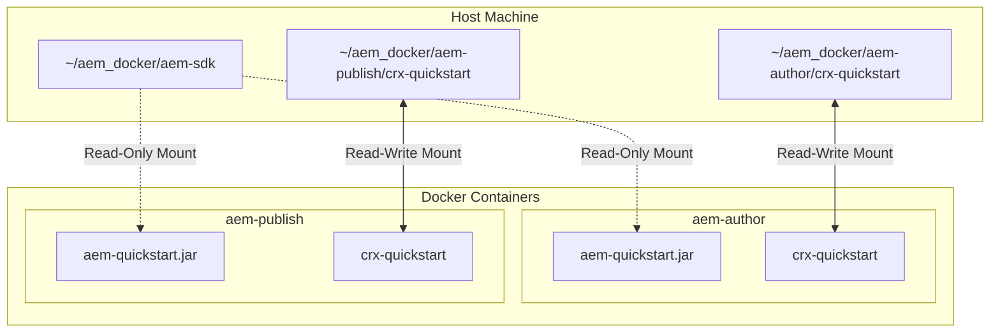

# AEM Docker Development Environment

This project sets up a local Docker-based development environment for Adobe Experience Manager (AEM). It provides isolated, pre-configured containers for running **AEM Author** and **AEM Publish** instances.

By using Docker, you ensure a consistent runtime environment (Java version, system libraries) across your team, while using host bind mounts to persist repository data and separate system files from proprietary AEM binaries.

---

## Technical Details

### Architecture Overview



### Components & Ports

| Service Name | Default Port | Internal Port | Default Runmodes | Host Bind Mount Path | Description |
| :--- | :--- | :--- | :--- | :--- | :--- |
| `author` | **4502** | 4502 | `author,nosamplecontent` | `./aem-author/crx-quickstart` | AEM Content Authoring Instance |
| `publish` | **4503** | 4503 | `publish` | `./aem-publish/crx-quickstart` | AEM Content Delivery Instance |

### Container Runtime Configuration

*   **Base Image:** `eclipse-temurin:21-jdk-jammy`
    *   Ensures AEM runs under the official Eclipse Temurin OpenJDK 21 runtime.
    *   Required by AEM SDK `2026.5.25892` and later. See `aem_sdk_jdk21.md` for upgrade history.
    *   Compatible with the local AEM as a Cloud Service SDK jar in `aem-sdk/aem-quickstart.jar`.
*   **JVM Settings:**
    *   Min Memory (`-Xms`): `1024m`
    *   Max Memory (`-Xmx`): `2048m` (Configurable via `JVM_OPTS` in `docker-compose.yml`)
    *   Max Metaspace (`-XX:MaxMetaspaceSize`): `512m`
*   **AEM Execution Mode:**
    *   Runs with `-nofork` to keep the Java process attached to the container PID 1, preventing the container from shutting down immediately after launch.

---

## Directory Structure

```text
~/aem_docker/
├── Dockerfile              # Docker recipe for the AEM base JDK 21 environment
├── docker-compose.yml       # Orchestrates the containers, volumes, and ports
├── entrypoint.sh           # Shell script to validate the jar and bootstrap AEM
├── aem_docker.md           # This documentation file
└── aem-sdk/                # SDK volume (Put your jar file here)
    ├── README.md           # Instructions on how to download AEM SDK
    └── .gitkeep
```

---

## Getting Started

### 1. Place AEM SDK Jar

Download the AEM as a Cloud Service SDK from Adobe Software Distribution, extract the quickstart jar, and place it in this project:

1. Copy your AEM quickstart jar file into `~/aem_docker/aem-sdk/`.
2. Rename the jar file to: `aem-quickstart.jar`

The AEM as a Cloud Service SDK no longer requires `license.properties` for local SDK startup.

Your `aem-sdk` folder should look like this:
```text
~/aem_docker/aem-sdk/
├── aem-quickstart.jar
└── README.md
```

### 2. Start the Containers

Launch the Docker Compose environment in detached mode (in the background):

```bash
docker compose up -d
```

Docker will build the AEM base image (on first run) and start the containers.

To run only one local Author container without Docker Compose:

```bash
docker build -t aem-local .
docker run --name aem-author \
  -p 4502:4502 \
  -p 5005:5005 \
  -e AEM_RUNMODE=author,nosamplecontent \
  -e AEM_PORT=4502 \
  -e AEM_DEBUG=false \
  -e JVM_OPTS="-Xms1024m -Xmx2048m -XX:MaxMetaspaceSize=512m" \
  -v "$PWD/aem-sdk/aem-quickstart.jar:/opt/aem/aem-quickstart.jar:ro" \
  -v "$PWD/aem-author/crx-quickstart:/opt/aem/crx-quickstart" \
  aem-local
```

> [!NOTE]
> On the first startup, AEM will take **5 to 10 minutes** to unpack the jar and initialize the CRX repository. You can watch this process by tailing the logs (see below).

### 3. Verify the Installation

You can check if the instances are ready by browsing to:
*   **Author Instance:** [http://localhost:4502](http://localhost:4502) (Login with `admin` / `admin` once initialized)
*   **Publish Instance:** [http://localhost:4503](http://localhost:4503)

---

## Maintenance & Operations

### Monitoring Logs

Since AEM logs are written inside the container, you can view them in two ways:

1.  **Via Docker Logs (Streams STDOUT/STDERR):**
    ```bash
    docker compose logs -f
    ```
    Or stream logs for a single service:
    ```bash
    docker compose logs -f author
    ```

2.  **Directly from Host Filesystem:**
    Because the `crx-quickstart` directory is bind-mounted, AEM's actual log files are accessible directly on your host machine:
    ```bash
    tail -f ~/aem_docker/aem-author/crx-quickstart/logs/error.log
    tail -f ~/aem_docker/aem-publish/crx-quickstart/logs/error.log
    ```

### Stopping and Starting

*   **Stop containers (preserves data):**
    ```bash
    docker compose stop
    ```
*   **Start stopped containers:**
    ```bash
    docker compose start
    ```
*   **Tear down containers (keeps host volumes intact):**
    ```bash
    docker compose down
    ```
*   **Destroy all persistent data (Hard Reset):**
    ```bash
    docker compose down -v
    # Delete the unpacked crx-quickstart directories on the host
    rm -rf ~/aem_docker/aem-author/crx-quickstart
    rm -rf ~/aem_docker/aem-publish/crx-quickstart
    ```

---

## Customization

### Adjusting JVM Settings

If your system has ample RAM, you can increase AEM memory by editing `docker-compose.yml` and modifying `JVM_OPTS`:

```yaml
environment:
  - JVM_OPTS=-Xmx4096m -XX:MaxMetaspaceSize=1024m
```

### Changing Runmodes

If you want to enable a specific runmode (e.g. `dev`, `local`, `nosamplecontent`), append it to `AEM_RUNMODE` in `docker-compose.yml`:

```yaml
environment:
  - AEM_RUNMODE=author,dev,nosamplecontent
```
